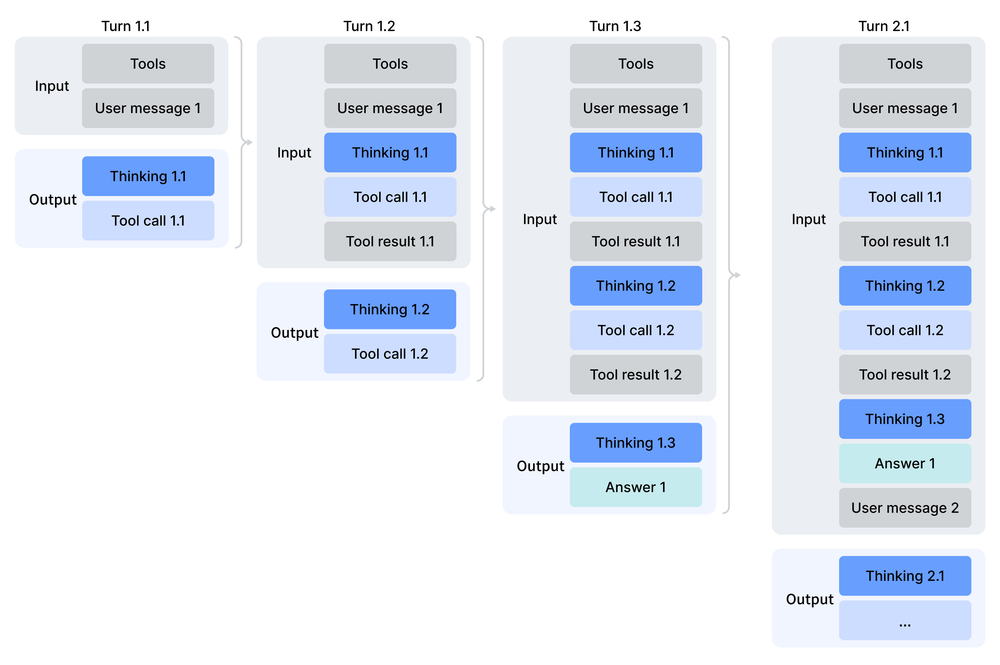
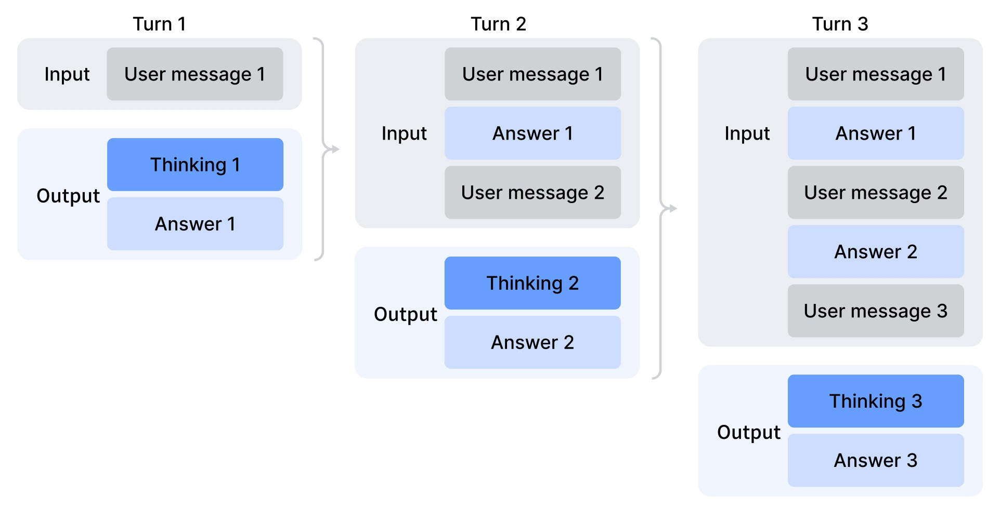
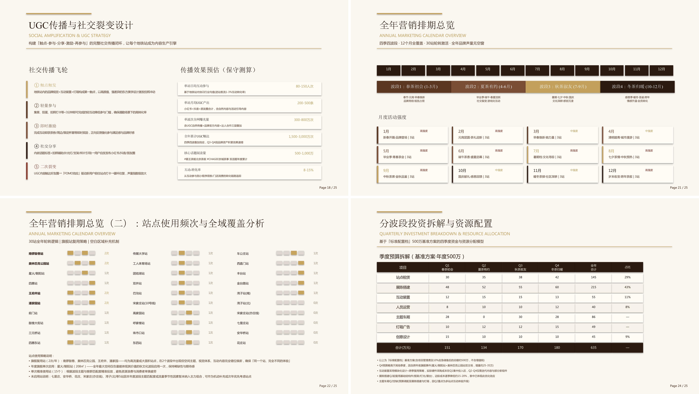
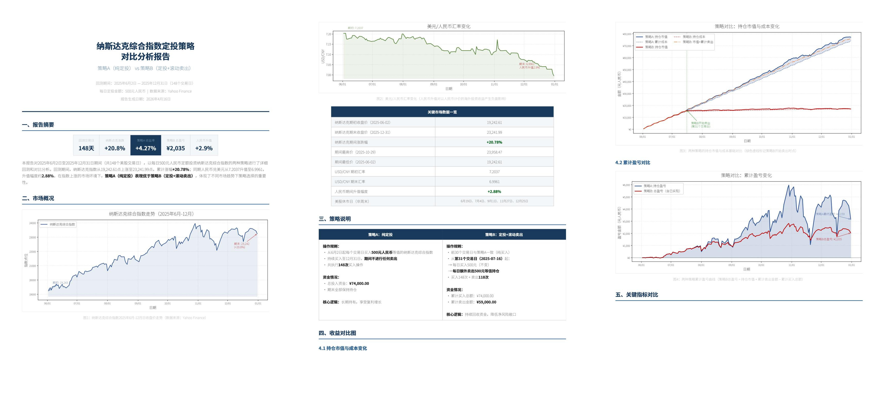
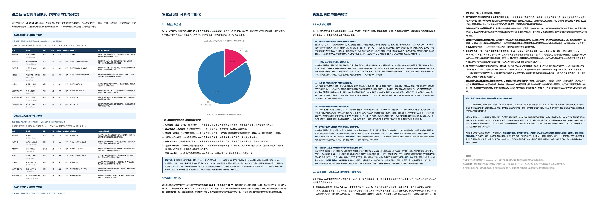

# DeepSeek-V4：把百万 Token 上下文真正做“能用”的开源大模型

DeepSeek-V4 这篇技术报告的核心，不是单纯把参数继续做大，而是试图解决一个更基础、也更现实的问题：当推理越来越依赖长上下文和 Test-Time Scaling 时，传统注意力的二次复杂度已经成了天花板。

这也是为什么 DeepSeek-V4 的关键词不是“更大”，而是 **更长**、**更稳**、**更省**。

论文给出的两条主线非常清晰：

- 一条是 **架构创新**：用混合注意力把百万上下文真正落地。
- 一条是 **系统工程**：从训练、推理、量化、KV Cache 到 agent sandbox，整套基础设施一起升级。

如果只用一句话总结，那就是：

> DeepSeek-V4 想做的，不是“支持 1M 上下文”的展示型模型，而是“在 1M 上下文下，FLOPs 和 KV Cache 依然可接受”的生产级模型。

## 先看结论：DeepSeek-V4 到底强在哪

DeepSeek-V4 系列包含两个主模型：

- **DeepSeek-V4-Pro**：总参数 1.6T，每个 token 激活 49B。
- **DeepSeek-V4-Flash**：总参数 284B，每个 token 激活 13B。

二者都原生支持 **1M tokens** 上下文。

相比 DeepSeek-V3.2，论文最强调的不是绝对分数，而是 **长上下文下的推理成本下降幅度**：

- 在 1M 上下文时，**DeepSeek-V4-Pro** 的单 token 推理 FLOPs 只有 DeepSeek-V3.2 的 **27%**。
- KV Cache 只有 DeepSeek-V3.2 的 **10%**。
- **DeepSeek-V4-Flash** 进一步把 FLOPs 压到 **10%**，把 KV Cache 压到 **7%**。

这件事非常关键。因为百万上下文真正难的，从来不是“能不能塞进去”，而是：

1. 算不算得动。
2. KV Cache 能不能放得下。
3. 推理延迟能不能接受。
4. 训练和后训练能不能稳定。

DeepSeek-V4 的价值，就在于它对这四件事都给出了成体系的答案。

> 图解：这张图主要展示 DeepSeek-V4-Pro-Max 与其他强模型在知识、推理、Agent 等任务上的总体对比。横向看不同任务，纵向看准确率或 Pass@1，可以看到 DeepSeek-V4-Pro-Max 在开源模型中处于第一梯队，尤其在知识问答、代码与 Agent 能力上竞争力很强。

> 图解：这张图更重要，因为它展示的是 **长上下文成本曲线**。横轴是序列长度，纵轴分别是单 token FLOPs 和累计 KV Cache 大小。序列变长后，DeepSeek-V4-Pro 和 Flash 的增长速度明显慢于 V3.2，这正是混合注意力设计的直接收益。

## 为什么必须重写注意力：长上下文时代的瓶颈变了

论文开篇的判断很到位：现在大模型性能提升，越来越依赖“推理时多想一会儿”，也就是 Test-Time Scaling。问题是，只要模型在“多想”的过程中需要读取更长历史，传统 Attention 就会越来越贵。

标准 Attention 的核心问题是：

- 计算复杂度随序列长度近似二次增长。
- KV Cache 随序列长度线性暴涨。
- 长链路 Agent、跨文档分析、超长代码仓理解等任务，都会把瓶颈推到极限。

也就是说，未来模型智能不只是“参数规模”问题，而是 **上下文效率** 问题。

DeepSeek-V4 的整体思路可以概括成三点：

1. 用 **CSA + HCA 混合注意力** 解决长上下文成本。
2. 用 **mHC** 增强残差连接的稳定性与表达力。
3. 用 **Muon** 优化器提升大规模训练的收敛速度和稳定性。

下面分别拆开说。

## 整体架构：还是 Transformer，但关键模块全换了

DeepSeek-V4 沿用了 Transformer 主体，也保留了 DeepSeek 系列之前的两大设计：

- **DeepSeekMoE**
- **MTP（Multi-Token Prediction）**

但在三处做了核心升级：

- 残差连接升级为 **mHC**
- 注意力升级为 **CSA + HCA 混合注意力**
- 大部分参数训练使用 **Muon** 优化器

这意味着 V4 不是推翻重来，而是在保留 MoE 和 MTP 主线的前提下，把最影响长上下文效率和训练稳定性的部位彻底改造。

## mHC：不是简单加宽残差，而是给残差“上约束”

### 标准 Hyper-Connections 在做什么

mHC 的出发点，是增强层与层之间的信息传播。标准 Hyper-Connections 会把原本一条残差流扩展成多条，让网络多一维可扩展性。

论文给出的标准形式是：

$$
X_{l+1}=B_l X_l + C_l F_l(A_l X_l)
$$

这里：

- $X_l$ 是第 $l$ 层前的残差状态。
- $A_l$ 把扩展后的残差映射回层输入。
- $F_l$ 是当前层。
- $B_l$ 控制残差传播。
- $C_l$ 控制层输出注入残差的方式。

直观来看，这相当于把“原来一条残差高速公路”变成了“多车道高速公路”。

### 问题：宽了之后，训练会更不稳定

标准 Hyper-Connections 确实有潜力，但堆深之后容易数值不稳定。原因也不难理解：如果残差变换矩阵 $B_l$ 没有限制，层数一深，信号就可能在前向或反向传播中放大失控。

### mHC 的关键：把残差映射约束到双随机矩阵流形

DeepSeek-V4 的做法，是把残差映射矩阵限制在双随机矩阵集合里：

$$
\mathcal{M}=\{M \in \mathbb{R}^{n\times n}\mid M\mathbf{1}=\mathbf{1},\mathbf{1}^T M=\mathbf{1}^T,M\ge 0\}
$$

这个约束的意义非常强：

- 每行和每列都归一。
- 元素非负。
- 谱范数有上界，残差变换更接近非扩张映射。

论文强调，这样做能显著提升：

- 前向传播稳定性
- 反向传播稳定性
- 深层堆叠时的可训练性

这其实体现了一种很好的设计哲学：**不是让模型更自由，而是让“自由”发生在稳定边界内。**

### mHC 是怎么实现的

论文没有只停留在理论层面，而是给出了完整工程实现：

- $A_l$、$B_l$、$C_l$ 都由动态参数和静态参数组成。
- 输入先做展平和 RMSNorm。
- 对 $A_l$ 和 $C_l$ 用 Sigmoid 保证非负和有界。
- 对 $B_l$ 用 Sinkhorn-Knopp 算法投影到双随机矩阵空间。

也就是说，mHC 不是“拍脑袋加个约束”，而是从参数化到数值投影都形成了闭环设计。

我对这一部分的理解是：**mHC 的价值不在于多了一个 fancy 名字，而在于它把“更强表达能力”和“更稳训练”放进了同一个残差框架里。**

## 真正的主角：CSA + HCA 混合注意力

如果只选论文里一个最重要的贡献，我会选这一部分。

因为 DeepSeek-V4 所有“百万上下文可用”的承诺，几乎都建立在这里。

## CSA：先压缩 KV，再做稀疏注意力

CSA 全称是 **Compressed Sparse Attention**。

它做了两件事：

1. 把每 $m$ 个 token 的 KV 压成一个条目。
2. 对压缩后的 KV 再做 Top-k 稀疏选择。

### 第一步：压缩 KV

压缩后的表示可以抽象写成：

$$
C_i^{\text{Comp}}=\sum_{j \in \text{block}(i)} \alpha_{ij} C_j,\quad \sum_j \alpha_{ij}=1
$$

也就是说，一个压缩块不是简单平均，而是 **学习得到的加权聚合**。

论文中实际做得更复杂：

- 有两组 KV 表示。
- 有对应压缩权重。
- 带位置偏置。
- 压缩块之间还有重叠。

结果是，CSA 本质上把序列长度压到了原来的大约 $1/m$。

### 第二步：用 Lightning Indexer 先筛，再算主注意力

即便压缩了，如果上下文是 1M，压完之后仍然很长。所以 CSA 又加了一个轻量级索引器。

流程是：

- 先为压缩块生成 indexer keys。
- 为查询 token 生成低秩 indexer queries。
- 计算每个压缩块的重要性分数。
- 只保留 Top-k 块进入核心注意力。

这相当于先做一轮“粗检索”，再做精注意力。

这个结构的思想非常像搜索系统：

- 压缩 KV 像建立倒排索引或分块摘要。
- Lightning Indexer 像召回器。
- 核心注意力像精排器。

所以 CSA 的本质，不是简单稀疏化，而是 **把长上下文注意力改造成“压缩 + 检索 + 精算”的两阶段系统**。

## HCA：压得更狠，但保留稠密注意力

HCA 全称是 **Heavily Compressed Attention**。

和 CSA 相比，它更激进：

- 压缩比更大，记为 $m'$。
- 不再做稀疏选择。
- 对压缩后的 KV 做稠密注意力。

也就是说：

- CSA 适合兼顾覆盖范围与选择性。
- HCA 适合极限压缩和进一步节省成本。

论文里给的设定很典型：

- CSA 的压缩率 $m=4$
- HCA 的压缩率 $m'=128$

这已经不是“小优化”了，而是彻底改变了注意力的成本结构。

## 为什么要混用 CSA 和 HCA，而不是二选一

这是我觉得论文最聪明的地方之一。

如果只有 CSA：

- 选择性强。
- 但 indexer 和 sparse attention 也有自己的开销。

如果只有 HCA：

- 压缩极致。
- 但信息分辨率可能损失更大。

DeepSeek-V4 没有赌单一路线，而是 **在层间交替使用 CSA 与 HCA**。这样做的好处是：

- CSA 负责更细粒度的信息检索。
- HCA 负责极限成本控制。
- 再加上滑动窗口分支保留局部精细依赖。

这其实是一个非常工程化的折中：**全局远距依赖靠压缩表示，局部精细依赖靠 sliding window，关键块检索靠 sparse selector。**

## 为了不丢局部细节，论文又补了三个关键技巧

### 1. 滑动窗口分支

压缩注意力有一个天然问题：同一压缩块内部的 token 细节容易丢失。

所以 DeepSeek-V4 额外保留了一个 **Sliding Window Attention** 分支，让每个 query 还能直接看到最近的若干原始 token。

这一步很重要，因为语言建模里近邻 token 往往最相关。

### 2. Partial RoPE

RoPE 不是全维使用，而是只作用在最后 64 维。

这样做的动机是：

- 保留相对位置建模能力。
- 又不让整个压缩表征完全被位置编码主导。
- 同时控制开销。

### 3. Attention Sink

论文引入了 learnable sink logits，让每个注意力头可以把一部分概率质量“吸走”。

直观理解，这相当于给注意力一个“空槽位”：

- 当当前 query 不想强行关注历史 token 时。
- 可以把部分质量分配给 sink。
- 从而避免无意义的强制归一化。

这个技巧对超长上下文尤其有帮助，因为不是所有 query 都需要在巨长历史中找到强匹配。

## 从成本角度看，为什么 DeepSeek-V4 确实更高效

论文总结了四个来源：

- KV 混合精度存储：RoPE 维度用 BF16，其余维度用 FP8。
- Lightning Indexer 里的 attention 计算可用 FP4。
- Top-k 选得更小。
- 最核心的是压缩注意力与混合注意力本身。

所以 V4 的效率提升，不是某一个 trick 的功劳，而是：

> **结构压缩** + **存储压缩** + **低精度计算** + **检索式稀疏化** 一起叠加出来的。

## Muon 优化器：让大模型训练更快、更稳

除了注意力，V4 的另一条主线是优化器。

论文中的大部分模块使用 **Muon**，只把以下参数继续交给 AdamW：

- embedding
- prediction head
- mHC 的静态偏置和 gating factors
- RMSNorm 权重

### Muon 在做什么

Muon 的核心特点是：

- 用动量缓冲累积梯度。
- 用 Newton-Schulz 迭代做近似正交化。
- 对更新矩阵重新缩放 RMS。
- 再进行参数更新。

论文中的关键更新过程可以概括为：

$$
M_k=aM_{k-1}+b(M_{k-1}M_{k-1}^T)M_{k-1}+c(M_{k-1}M_{k-1}^T)^2M_{k-1}
$$

这一步的目标，是把矩阵逐步推向近似正交形式。

为什么这有用？因为在大模型训练中，参数更新如果方向畸变太厉害，优化过程很容易不稳定。Muon 试图让更新矩阵的几何性质更“规整”。

### 为什么 DeepSeek-V4 适合 Muon

论文还提到一个细节：由于 V4 的注意力结构可以直接对 query 和 KV 做 RMSNorm，因此 attention logits 更不容易爆炸。这反过来让训练时不再需要 QK-Clip 之类的额外措施。

这说明优化器升级不是孤立事件，而是和架构设计联动的：

- 注意力更稳。
- 优化器更敢跑。
- 训练整体更稳定。

## 工程基础设施：这篇论文有一半价值在系统里

如果你是做大模型工程的，这篇论文最值得读的，其实不止模型结构，而是 Section 3 和 Section 5。

因为它几乎把一个百万上下文模型从训练到部署要踩的坑，都讲了一遍。

## 专家并行：把通信“藏”到计算后面

MoE 训练最痛的一点，就是 Expert Parallelism 带来的跨节点通信。

DeepSeek-V4 的方案是：

- 把 Dispatch / Combine 和专家计算融合进单个 pipeline。
- 再把 experts 拆成 wave。
- 做更细粒度的通信-计算重叠。

论文给出的结果很强：

- 通用推理场景提速 **1.50 到 1.73 倍**
- RL rollout 等低延迟场景可达 **1.96 倍**

这个思路很实用：**不是想办法把通信完全消灭，而是让它尽量不出现在关键路径上。**

## TileLang：为了让复杂 kernel 不至于写崩

DeepSeek-V4 的 kernel 很多，尤其在注意力、MoE、量化和融合算子上。如果全用手写 CUDA，开发维护成本会爆炸。

他们选择 TileLang，原因很现实：

- 既能做高性能 fused kernel。
- 又能保持较高开发效率。
- 还支持形式化整数分析、Host Codegen、数值精度控制、bitwise reproducibility。

这部分透露出一个信号：**下一代大模型系统栈，越来越需要“性能 + 可维护性”兼顾的 DSL 层。**

## Batch-Invariant 与 Deterministic：不是锦上添花，而是调参救命

论文特别强调端到端的：

- batch invariance
- determinism

为什么重要？

因为在超大规模训练里，一旦出现 loss spike 或硬件异常，如果结果不可复现，你几乎没法调。

DeepSeek-V4 针对几个最难做确定性的地方给了方案：

- Attention backward：为每个 SM 分开累积，再做全局确定性求和。
- MoE backward：预处理 token 顺序，避免写冲突带来的非确定性。
- mHC 里的小矩阵乘法：拆分后再做确定性归约。

这类细节平时很少在模型论文里展开，但真正落地时非常关键。

## FP4 QAT：把低精度从“部署 trick”变成训练内生能力

论文把 FP4 量化感知训练用到了两个地方：

- MoE expert 权重
- CSA indexer 的 QK 路径

它的价值有两层：

1. 降内存、提推理速度。
2. 让训练时就适应低精度噪声，部署更稳。

尤其 indexer 的那部分很有意思：

- QK activation 全链路可缓存、加载、相乘于 FP4。
- index score 从 FP32 量化到 BF16。
- Top-k selector 获得 **2 倍加速**。
- 同时保留 **99.7% recall**。

这说明 DeepSeek-V4 不是只在主干网络上发力，而是连“辅助检索模块”的精度路径都单独优化了。

## 训练框架：专门为 Muon、mHC 和长上下文改过

DeepSeek-V4 的训练框架做了几个关键增强：

- 为 Muon 设计了 hybrid ZeRO 策略。
- 为 mHC 做了 fused kernels 和 selective recomputation。
- 为长上下文压缩注意力设计了 contextual parallelism。
- 把 activation checkpointing 做到 tensor 级别，而不是 module 级别。

我觉得最有价值的是最后一项。因为传统 checkpointing 粒度太粗，经常在内存和重算成本之间两头不讨好。V4 通过 tensor 级自动重算，让开发者只标记张量，框架自己回溯最小重算图。

这很像把“手工内存优化”升级为“编译器辅助内存优化”。

## 推理框架：DeepSeek-V4 的 KV Cache 已经不是传统 KV Cache 了

### 为什么老的 PagedAttention 不够用了

因为 V4 的注意力不是单一结构，而是混合体：

- CSA 层
- HCA 层
- Sliding Window 层
- 未完成压缩的尾部 token buffer

这些缓存的：

- 大小不同
- 更新规则不同
- 命中策略不同

所以不能再把所有层都塞进一个统一的 page 视角里。

### DeepSeek-V4 的做法：把 KV Cache 拆成两类

1. **classical KV cache**  
   存储 CSA / HCA 压缩后的 KV。

2. **state cache**  
   存储 SWA 的 KV 和尚未压缩完成的尾部 token 状态。

这个设计非常合理。因为未压缩尾部和滑动窗口，本质上更像“与当前位置绑定的状态”，而不是可随意分页复用的全局缓存。

### On-Disk KV Cache：为共享前缀服务

对于共享前缀请求，DeepSeek-V4 还把部分 KV Cache 存盘，以避免重复 prefill。

SWA 部分给了三种策略：

- **Full SWA Caching**
- **Periodic Checkpointing**
- **Zero SWA Caching**

三者分别在以下维度之间做不同权衡：

- 存储开销
- 重算成本
- 命中效率

这部分很有实战价值，因为它说明 **超长上下文服务的核心已经不只是算子问题，而是存储体系结构问题**。

## 预训练：不只是更大数据，而是更长、更杂、更像真实任务

DeepSeek-V4 的预训练语料超过 **32T tokens**，重点强调了五类数据：

- 数学
- 代码
- 网页
- 长文档
- 多语种高质量数据

其中一个很值得注意的点是：它明显增加了 **长文档数据**，比如论文、技术报告等。

这和模型目标非常一致。因为如果你想让模型真的会处理百万上下文，只在训练末期把长度拉长是远远不够的，数据本身也得具有“长程信息组织结构”。

### 训练长度调度

论文采用了逐步拉长的 curriculum：

- 4K
- 16K
- 64K
- 1M

并且不是一开始就用 sparse attention，而是：

- 先用 dense attention 预热。
- 到 64K 再引入 sparse attention。
- 对 Lightning Indexer 也单独 warmup。

这说明 DeepSeek-V4 很清楚一点：**长上下文能力不是一次性打开开关，而是要分阶段培养。**

## 模型配置：Flash 和 Pro 的差别在哪里

下面把论文里的核心配置整理成一个更容易阅读的表格。

| 模型 | 总层数 | 隐层维度 | 总参数 | 激活参数 | CSA Top-k | Query Heads |
| --- | --- | --- | --- | --- | --- | --- |
| DeepSeek-V4-Flash | 43 | 4096 | 284B | 13B | 512 | 64 |
| DeepSeek-V4-Pro | 61 | 7168 | 1.6T | 49B | 1024 | 128 |

还有几个关键共同点：

- CSA 压缩率 $m=4$
- HCA 压缩率 $m'=128$
- 滑窗大小 $n_{win}=128$
- 每个 token 激活 6 个 routed experts
- mHC 扩展因子 $n_{hc}=4$

从这个配置可以看出一个鲜明倾向：DeepSeek-V4 不是盲目追求更多 heads，而是围绕压缩注意力和 MoE 做整体搭配。

## 训练稳定性：论文里最接地气的一部分

超大规模 MoE 训练最怕的就是 loss spike。论文明确承认他们也遇到了，而且 rollback 只能暂时缓解，不能根治。

最后他们找到两个非常实用的方法。

### 1. Anticipatory Routing

核心思想是：**特征计算用当前参数，路由决策用历史参数。**

也就是在第 $t$ 步训练时，路由索引不是由 $\theta_t$ 计算，而是由更早的 $\theta_{t-\Delta t}$ 预先算好。

这相当于给路由网络加了一个“时间缓冲层”，减少路由和主干同步更新带来的恶性反馈。

论文还专门做了基础设施优化，把它只在检测到 loss spike 时临时开启，从而把总体额外开销压到很低。

### 2. SwiGLU Clamping

他们发现 MoE 层异常值和 loss spike 强相关，于是直接对 SwiGLU 做截断：

- 线性分支 clamp 到 $[-10,10]$
- gate 分支上界设为 $10$

这不是最优雅的理论方案，但在工程上非常有效。

这也让我觉得这篇论文有一个难得的优点：**它不装作一切都被完美理论解释了，而是愿意把真正有效的经验性解法写出来。**

## 基础模型结果：V4-Flash 已经比 V3.2 更划算，V4-Pro 则全面拉开

论文在 Base 模型阶段给了一个很有说服力的对比。

### 关键结论一：V4-Flash 用更少激活参数，打赢 V3.2-Base

这非常重要。因为它说明 V4 的提升不是纯粹靠“大力出奇迹”，而是结构效率确实更高。

### 关键结论二：V4-Pro-Base 几乎全面领先

下面挑几项代表性指标来看：

| Benchmark | V3.2-Base | V4-Flash-Base | V4-Pro-Base |
| --- | ---: | ---: | ---: |
| MMLU-Pro | 65.5 | 68.3 | 73.5 |
| Simple-QA Verified | 28.3 | 30.1 | 55.2 |
| FACTS Parametric | 27.1 | 33.9 | 62.6 |
| HumanEval | 62.8 | 69.5 | 76.8 |
| LongBench-V2 | 40.2 | 44.7 | 51.5 |

这个表最能说明的问题是：V4-Pro 的提升并不是只发生在某一类任务上，而是知识、代码、长上下文能力一起上涨。

## 后训练：从“混合 RL”转向“专家先练，再统一蒸馏”

DeepSeek-V4 的后训练范式，我认为比架构本身还值得关注。

它采用的是两阶段路线：

1. **Specialist Training**  
   先按领域分别训练专家模型，比如数学、代码、Agent、指令跟随。

2. **On-Policy Distillation**  
   再把多个专家蒸馏到一个统一学生模型里。

这比“所有能力直接混在一个 RL 流程里”更像工业化生产线。

## 三种推理模式：Non-think、Think High、Think Max

论文把推理 effort 设计成了显式模式：

| 模式 | 特点 | 适用场景 |
| --- | --- | --- |
| Non-think | 快速、直觉式响应 | 日常问答、低风险任务 |
| Think High | 更长推理链路 | 复杂问题、规划任务 |
| Think Max | 最大思考预算 | 最难的推理与 Agent 场景 |

这里最有意思的是，论文把推理预算不只当成采样超参数，而是 **当成模型能力配置的一部分** 来训练。

尤其 Think Max，还会在系统提示里明确告诉模型：

- 不允许走捷径。
- 要全面拆解问题。
- 要写出完整思路。
- 要检查边界情况和反例。

这本质上是在把“推理风格”作为训练目标之一。

## GRM：让模型自己学会“判自己”

传统 RLHF 常依赖标量奖励模型。DeepSeek-V4 更进一步，用 **Generative Reward Model** 替代传统 scalar reward。

核心想法是：

- 对难验证任务，直接让模型生成评估。
- actor 自己也承担 reward model 的角色。
- 把“会做”和“会判断做得对不对”统一起来训练。

这和近年来“生成式奖励”“自评估”的趋势是一致的，但论文把它放进了大规模后训练流水线里。

## OPD：把多个专家能力合并成一个统一学生

OPD 的目标函数是：

$$
L_{\text{OPD}}(\theta)=\sum_{i=1}^{N} w_i\, D_{KL}(\pi_\theta \,\|\, \pi_{E_i})
$$

这里：

- $\pi_\theta$ 是学生模型。
- $\pi_{E_i}$ 是第 $i$ 个专家模型。
- $w_i$ 是专家权重。

这一步的关键不是普通蒸馏，而是 **On-Policy**：

- 轨迹由学生自己采样。
- 再去对齐专家分布。

这样做的好处是，学生学到的是“自己真实会走到的状态下，应该如何模仿对应专家”，而不是在离线静态数据上硬学。

### 为什么论文坚持做 full-vocabulary distillation

很多工作为了省资源，会把 KL 简化成 token-level 近似。但论文认为，这会带来高方差和不稳定。

所以 V4 直接做 **全词表 logits 蒸馏**。

代价当然更高，但它通过系统设计把这件事真正做成了：

- teacher 权重集中存储，按需加载。
- 不缓存完整 logits，而是缓存最后一层 hidden states。
- 训练时动态过 prediction head 重建 logits。
- teacher head 按样本排序装载，减少显存驻留。

这部分非常漂亮，因为它把“理论上更好的目标函数”通过工程手段变成了“实践中也能跑得动”。

> 图解：这张图展示带工具调用时的思维管理策略。DeepSeek-V4 会保留跨轮推理痕迹，让模型在长周期 Agent 任务里保持连续思考，而不是每轮用户消息都把之前的 reasoning 清空。

> 图解：这张图展示普通对话场景下的思维管理。没有工具链协作时，系统会更偏向清理旧推理内容，避免上下文被冗长思维链占满。这说明 V4 对“思维保留”不是一刀切，而是按场景动态管理。

## Tool Calling、Interleaved Thinking、Quick Instruction：V4 已经把 Chatbot 当 Agent 在设计

这一段很容易被忽略，但其实很前沿。

### 1. 新的 Tool-Call Schema

DeepSeek-V4 用特殊 token `|DSML|` 和 XML 风格工具调用格式，目的很明确：

- 降低 escaping 失败。
- 降低工具调用格式错误。
- 让模型和工具接口更稳。

### 2. Interleaved Thinking

如果是工具场景，V4 会保留完整 reasoning 历史；如果是一般聊天，则在新用户轮次到来时丢弃旧 reasoning。

这本质上是在做 **按任务类型区分的思维记忆管理**。

### 3. Quick Instruction

它把一些辅助任务直接变成特殊 token，比如：

- 是否需要搜索
- 生成搜索 query
- 判断权威性要求
- 判断领域
- 是否需要读取 URL

这背后的收益非常实际：

- 不必再起一个小模型做辅助决策。
- 复用现有 KV Cache。
- 减少额外 prefill。
- 降低 TTFT。

也就是说，DeepSeek-V4 已经在把“推理主模型”和“辅助工作流控制器”逐渐合并。

## 标准 Benchmark：V4-Pro-Max 基本重写了开源模型上限

论文对 V4-Pro-Max 和闭源强模型做了正面对比。这里不逐项抄表，我提炼成四点。

### 1. 知识任务：开源新 SOTA

在 SimpleQA、Chinese-SimpleQA 等知识任务上，DeepSeek-V4-Pro-Max 基本已经把开源模型拉开了。

比如：

- SimpleQA-Verified：**57.9**
- Chinese-SimpleQA：**84.4**
- ApexShortlist：**90.2**

和 Gemini-3.1-Pro 相比，仍有部分差距，但在开源阵营里已经很能打。

### 2. 推理任务：离最强闭源只差半代

论文自己的判断很克制：V4-Pro-Max 大概比最前沿闭源模型落后 **3 到 6 个月**。

这个说法我觉得比较可信。因为从 HLE、GPQA、Apex、Codeforces 等任务看，它已经明显不是“普通开源模型”那一档了。

尤其 Codeforces rating 达到 **3206**，论文还提到在人类榜单中排到 **第 23**。

### 3. Agent 任务：开源第一梯队，但最难任务仍有差距

在 TerminalBench2.0、SWE-Verified、MCPAtlas、Toolathlon 等任务上，V4-Pro 的表现相当强。

但论文也承认：

- 和顶尖闭源模型相比，仍不是全面超越。
- 更复杂、长链、开放环境的 Agent 任务里，Pro 明显比 Flash 更稳。

### 4. 1M 上下文：不是噱头，真有用

V4-Pro 在 MRCR 和 CorpusQA 这种百万上下文评测上表现非常亮眼，甚至超过 Gemini-3.1-Pro。

这说明它不仅“容得下 1M”，而且 **在这么长的上下文里仍保有检索和分析能力**。

## 为什么 Think Max 确实更强

论文给了一个很明确的趋势：推理预算越高，越难任务收益越大。

这其实并不新鲜，但 V4 特别的地方在于：

- 它把不同 thinking mode 做成了训练时就区分的能力档位。
- 不是简单靠 inference-time prompt trick 硬撑。

所以 Think Max 的提升，更像是“训练出来的长推理风格”，而不是“推理时临时拉长输出”。

## 真实世界任务：这里反而更能看出 V4 的价值

Benchmark 只是能力切片，真正决定用户体验的还是现实任务。

论文专门做了四类内部评估。

## 中文写作：这可能是 DeepSeek-V4 最实用的亮点之一

DeepSeek-V4-Pro 在中文功能写作和创意写作上表现非常强。

### 功能写作

对比 Gemini-3.1-Pro：

- 总体 win rate：**62.65%**
- 对手：**34.10%**

论文认为，Gemini 在中文写作里有时会把自己的风格偏好放在用户要求之前，而 V4-Pro 更愿意贴着需求写。

### 创意写作

- 指令遵循 win rate：**60.03%**
- 写作质量 win rate：**77.48%**

这组数字其实很夸张，尤其是写作质量优势非常明显。

不过论文也很诚实：在 **复杂指令跟随** 和 **多轮写作** 这种高难场景里，Claude Opus 4.5 仍略强。

## 搜索：Agentic Search 比普通 RAG 更有效

DeepSeek Chat 的搜索分为两种：

- Non-think：RAG
- Thinking：Agentic Search

论文数据显示，Agentic Search 在复杂任务上明显更强，而且成本只比 RAG 略高。

这说明一个趋势：**搜索增强不再只是“检索 + 回答”，而越来越像“搜索—阅读—判断—再搜索”的闭环 Agent。**

## 白领任务：DeepSeek 开始正面冲击企业生产力场景

这部分是我觉得最有产品感的内容。

论文构造了 30 个高级中文白领任务，涵盖：

- 信息分析
- 长文生成
- 文档改写
- 金融、教育、法律、科技等 13 个行业

人工评估结果显示，DeepSeek-V4-Pro-Max 对比 Opus-4.6-Max：

- 总体 win：**53%**
- non-loss rate：**63%**

优势主要集中在：

- Task Completion
- Content Quality

也就是说，V4-Pro-Max 往往更愿意主动补足隐含需求，生成更完整、更像真正交付物的内容。

> 图解：这张图对应中文白领任务的人类评估结果。左侧一般是 win / tie / lose 比例，右侧是不同维度评分。可以看到 DeepSeek-V4-Pro-Max 在任务完成度和内容质量上尤其突出，但在格式美观和极细粒度格式约束上还有继续优化空间。

## Code Agent：已经接近顶级闭源模型

在内部研发任务构成的 Coding Benchmark 上：

- DeepSeek-V4-Pro-Max：**67%**
- Claude Opus 4.5：**70%**
- Claude Opus 4.6 Thinking：**80%**

这说明 V4-Pro 已经进入“可以作为默认主力代码模型考虑”的区间。

论文里还做了开发者调查：

- 52% 认为已经可以成为默认主力代码模型。
- 39% 倾向于可以。
- 不到 9% 认为不行。

这其实很有说服力，因为内部开发者的评价往往比 benchmark 更苛刻。

## 我认为这篇论文最重要的三点启示

### 1. 长上下文竞争，核心已经不是“窗口大小”，而是“单位 token 成本”

很多模型都能宣传自己支持超长上下文，但真正决定可用性的，是：

- 单 token FLOPs
- KV Cache 占用
- 工程上的缓存、重算与调度能力

DeepSeek-V4 真正厉害的，是把这三件事一起做了。

### 2. 下一代大模型能力提升，越来越依赖“架构 + 系统 + 后训练”联合优化

这篇论文非常清楚地说明：

- 不是只换注意力就够了。
- 不是只做 RL 就够了。
- 不是只做量化就够了。

真正的提升来自联动：

- 混合注意力
- Muon
- mHC
- FP4 QAT
- deterministic kernels
- OPD
- rollout 与 sandbox 基础设施

这是一种很“工业化”的大模型研发方法。

### 3. 开源模型已经开始真正追闭源的“完整产品能力”

V4 不只是做 benchmark 分数，而是在认真解决：

- 搜索
- Tool use
- Agent
- 中文写作
- 白领工作流
- 代码仓协作

这意味着开源模型的竞争，已经从“模型能力”进入“产品能力”阶段。

## 局限与未来方向：论文自己也很清醒

论文最后没有把 V4 描述成终点，而是承认了几件事：

- 当前架构为了控制风险，保留了很多经过验证但略复杂的组件。
- Anticipatory Routing 和 SwiGLU Clamping 虽然有效，但理论解释还不够充分。
- 还要继续探索新的稀疏维度，比如更稀疏的 embedding。
- 还要继续降低长上下文交互延迟。
- 还要扩展到 multimodal。
- 还要持续优化 long-horizon agent。

换句话说，DeepSeek-V4 更像是一个 **通向百万上下文智能体的工程里程碑**，而不是最终范式。

## 最后总结

如果让我用一句更偏博客化的话来收尾，那就是：

**DeepSeek-V4 真正解决的，不是“模型能不能看 1M token”，而是“模型在看 1M token 时，还能不能保持高质量推理、可接受成本，以及可部署的工程形态”。**

从论文结构看，DeepSeek-V4 的核心价值可以概括为四层：

- **模型层**：CSA + HCA 混合注意力，把超长上下文成本打下来。
- **训练层**：mHC 与 Muon 共同提升稳定性和收敛效率。
- **系统层**：EP、TileLang、Determinism、KV Cache、On-Disk Storage 全面支撑。
- **能力层**：通过 Specialist Training + OPD，把知识、推理、Agent、写作统一进一个模型。

所以，这篇论文最值得学习的，不只是某个公式或某个模块，而是一种完整的方法论：

> 想把下一代大模型做成“真正可用的长上下文智能体”，就必须同时重构 **注意力架构**、**训练稳定性**、**推理缓存系统** 和 **后训练流程**。

> 图解：这张图展示真实业务任务中的长文生成示例，通常对应复杂文档写作或分析报告场景。它说明 DeepSeek-V4 并不是只在标准 benchmark 上提升，而是开始面向真实交付物质量优化，包括结构组织、篇章连贯和信息完整性。

> 图解：这张图更像是长流程、多资料整合的最终产出示例，例如研究报告或分析型 PDF。它体现了百万上下文模型的一个直接用途：把多源材料整合成结构化长文档，而不只是回答一个短问题。

> 本文参考自 DeepSeek_V4（原文链接未提供）